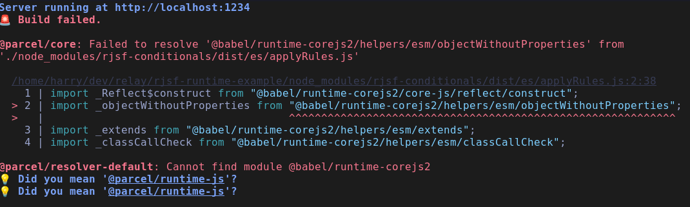

# RJSF babel/runtime-corejs2 Example

This is a minimal reproduction for the @babel/runtime-corejs2 issue.

When running this app with `yarn start` Parcel is unable to resolve the
`@babel/runtime-corejs2/core-js/reflect/construct` import from
`node_modules/rjsf-conditionals/dist/es/applyRules.js` because
`@babel/runtime-corejs2` is not available.

This appears to be a missing dependency - for applications already using
Babel as their build tool it's working because they have the library
already in their app, but for Parcel where it's not using Babel by
default this isn't the case.

## Usage

Install dependencies with `yarn install`.

Run the app with `yarn start`.
